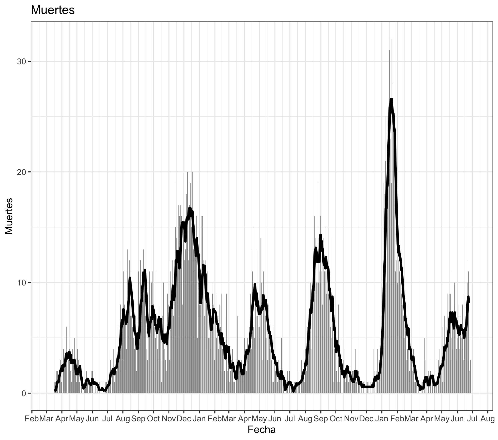
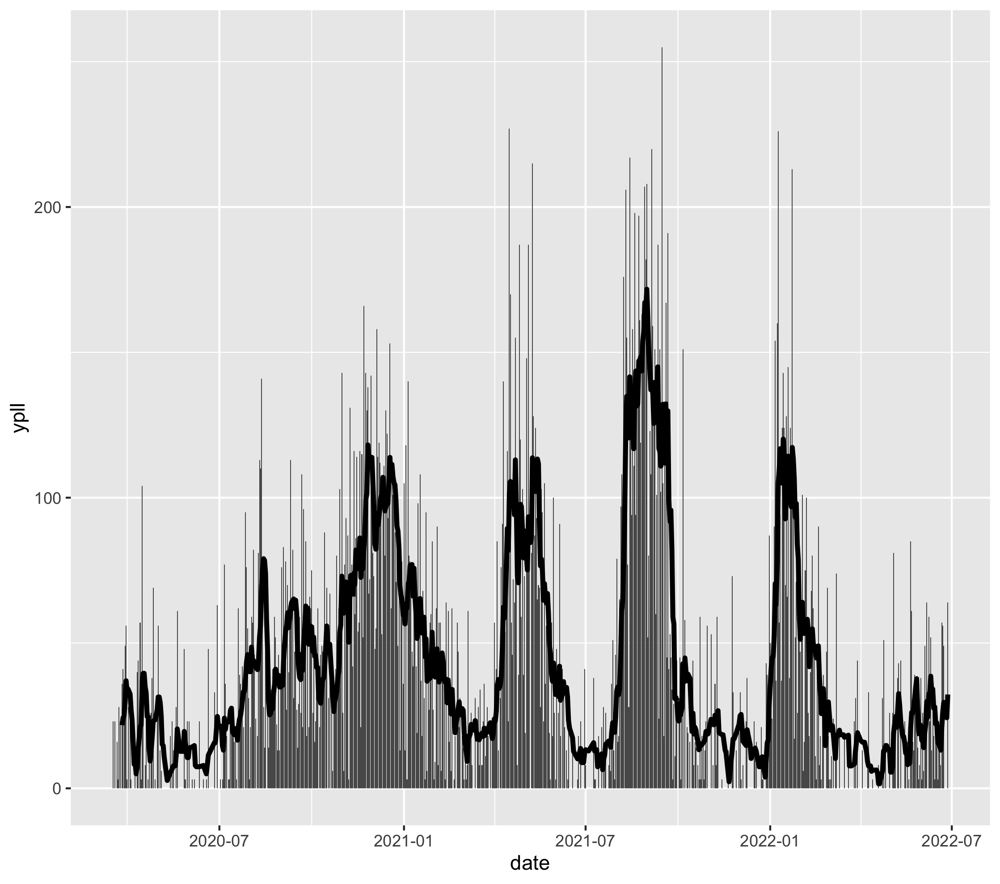

# Years of Potential Life Lost in PR due to COVID-19

Humberto Ortiz-Zuazaga  
2021-10-11  
**Updated:** 2022-07-01

## Abstract

In 2021, Puerto Rico has had three waves of COVID-19. Anectotally, there have
been more young victims in the third wave than in prior waves. Years of
Potential life lost, or YPLL, is an indicator used in public health to quantify
the loss in expected life due to a condition. We used YPLL to examine the
effects of COVID-19 in Puerto Rico, using data published by the PR Department of
Health. We find that although the absolute number of death has decreased, the
accumulated YPLL for the second wave was nearly the same as the first, and the
third wave is even higher.

## Introduction

The press has reported twice in September on the deaths of a five and a [six
year old
girl](https://www.elnuevodia.com/noticias/locales/notas/la-nina-de-seis-anos-que-murio-de-covid-19-se-contagio-en-su-entorno-familiar/)
from COVID-19 in Puerto Rico, adding to a number of younger and younger reported
deaths. We decided to investigate if these represented a trend, or were simply
unfortunate outliers. Years of Potential Life Lost
([YPLL](https://www.cdc.gov/injury/wisqars/fatal_help/definitions_ypll.html)) is
an indicator that can quantify the (expected) lost years of life due to a
disease or process. It is calculated by subtracting the actual age of death from
a standard expected age. For deaths ocurring after the expected age, no
contribution to the YPLL is added.

## Methods

We developed code in R to compute and plot the YPLL from data published by the
Puerto Rico Department of Health. The code makes extensive use of code developed
by Rafael Irizarry for his COVID dashboard (http://tpr.covidpr.info).

The PRDH reports an age range for each death. For each death, we compute the
average age in the age range, and if it is less than 75, we compute the
difference and add it to the YPLL. Life expectancy in Puerto Rico was nearly 80
prior to the pandemic, [according to the World
Bank](https://data.worldbank.org/indicator/SP.DYN.LE00.IN?locations=PR&view=chart).

The code for this analysis is available in github: https://github.com/humberto-ortiz/pr-ypll

## Results

### Cumulative YPLL

### Mortality

### YPLL

## Discussion

## Acknowledgements

Rafael Irizarry for his open source dashboard. Jose Conde for advice and
inspiration, especially regarding YPLL. Mary Torres for convincing me to work on
this issue. HOZ was supported in part by Institutional Development Award (IDeA)
INBRE grant P20 GM103475 from the National Institute for General Medical
Sciences (NIGMS), a component of the National Institutes of Health (NIH).

## References

1. https://www.elnuevodia.com/noticias/locales/notas/la-nina-de-seis-anos-que-murio-de-covid-19-se-contagio-en-su-entorno-familiar/
2. https://www.cdc.gov/injury/wisqars/fatal_help/definitions_ypll.html
3. http://tpr.covidpr.info.
4. https://data.worldbank.org/indicator/SP.DYN.LE00.IN?locations=PR&view=chart
5. https://github.com/humberto-ortiz/pr-ypll
6. https://github.com/rafalab/pr-covid
