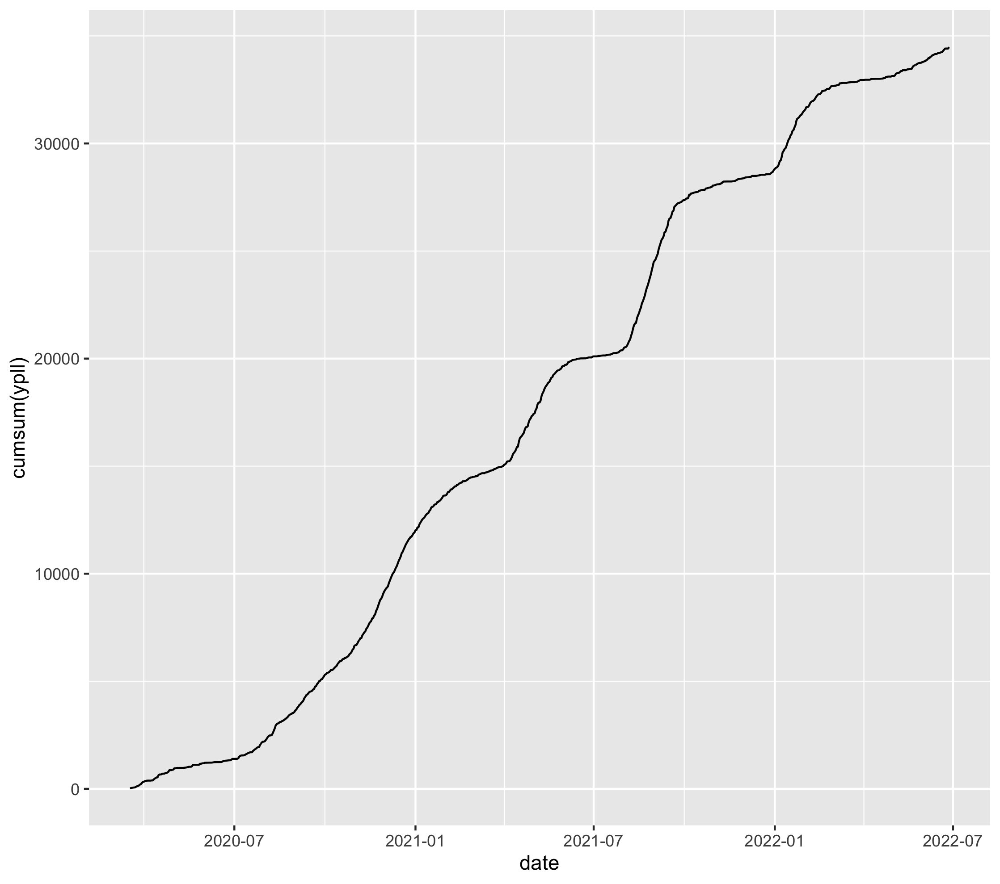

# Years of Potential Life Lost in PR due to COVID-19

Code to compute and plot YPLL from the Department of Health data.

Based on Rafael Irizarry's COVID-19 dashboard: https://github.com/rafalab/pr-covid

## Cumulative YPLL

## Mortality

## YPLL

